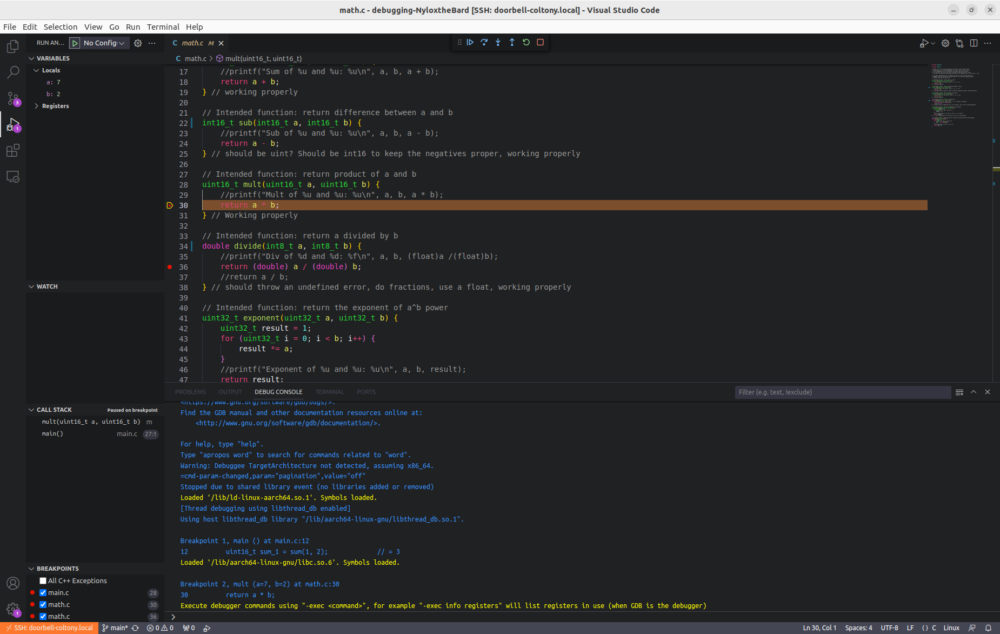
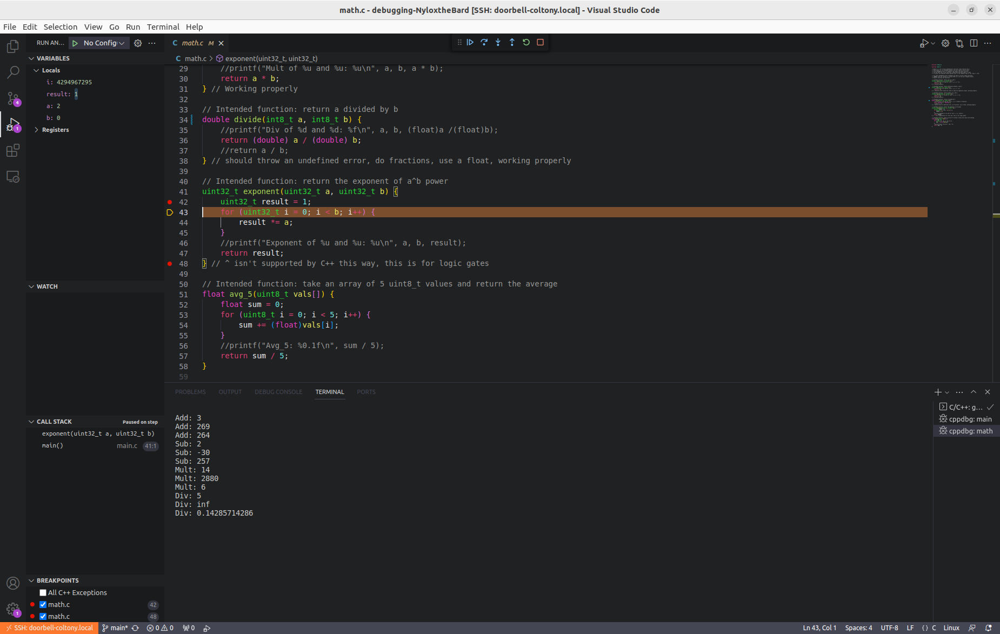
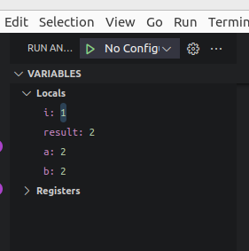
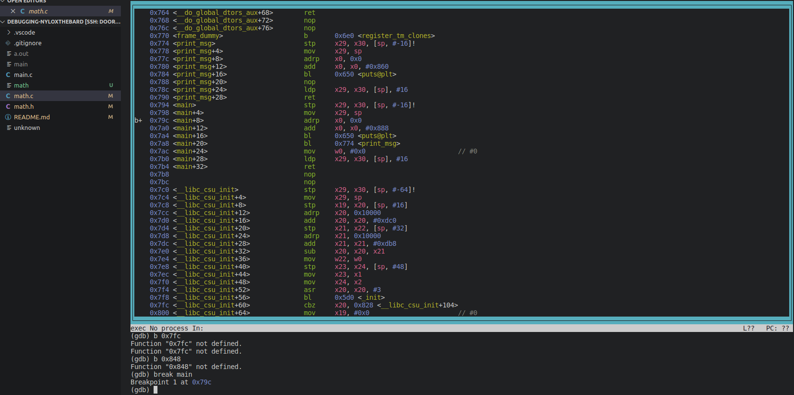
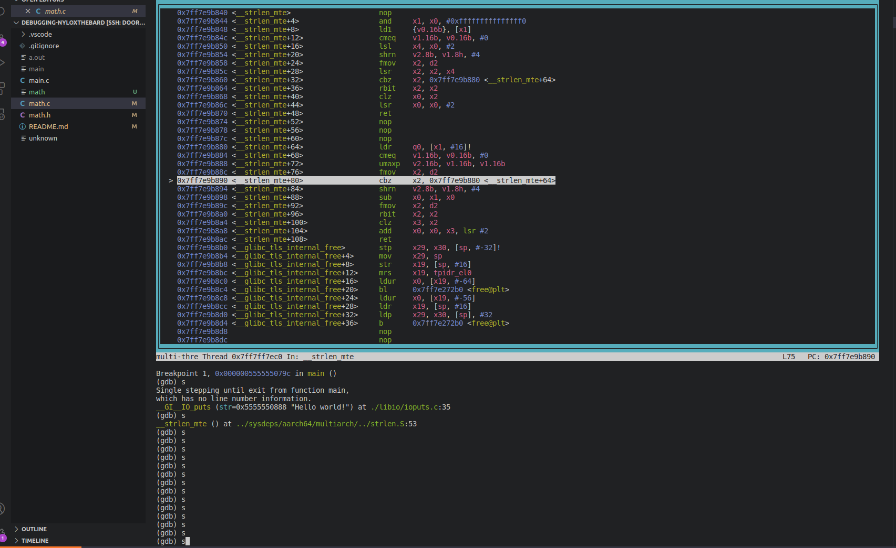
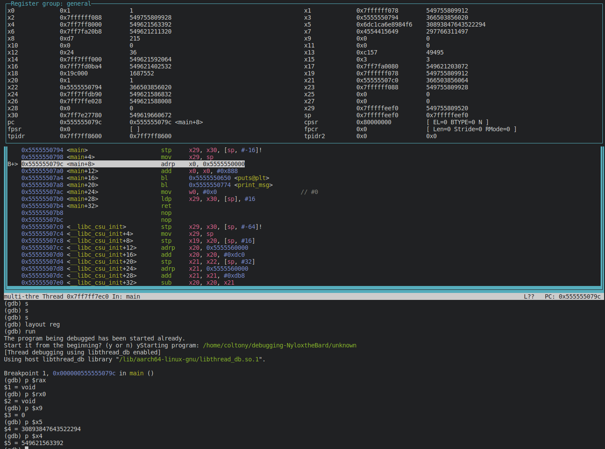

# Debugging

## Experience Summary

### How many hours did it take to complete the assignment?
3 hours

### What did you enjoy about this lab?
I liked working and figuring out what was wrong with each function, and making them work properly. It was also good practice on data types

### What were the major challenges you had with this lab? Try to be as detailed as possible.
Way too much for this one lab, I felt like it was two different labs crammed into one. The gdb information was also not great, and it was hard to figure out what was going. 

## Lab Specific Tasks

### Intentional and Incremental Programming

1. Why is intentional programming important?

Intentional programming is programming with a specific mindset of writing code that is clear and easy to understand. It is important as it directly reflects your intentions in an organized method rather than throwing code at a problem and seeing what sticks. It is a much more efficient and productive method of coding than just throwing code around at a wall like cheese to see what sticks and works. 

2. Why is incremental programming important?

Incremental programming is important as it divides a more complicated solution into smaller, easier sized chunks that are easier to program. Then, from these smaller chunks, you can bring all of those small parts together to get the desired solution. It is also easier to debug this, as if one specific chunk isn't working, it is easier to identify it and figure out why it isn't working. Changes can also be made easier, as instead of changing the entire solution you can only change the parts that you need changed. 

### Trace debugging

3. In the lab files for this repository, you will find three files of interest: `main.c`, `math.c`, `math.h`. Buggy functions have been included in the `math.c` file. Your job is to debug them using the trace debugging method and ensure that all of them work properly.

4. Explain where each function went wrong and how you fixed it.

Add Function - Changed the data type to 16-bit uint from 8-bit uint to fit the output correctly, in order to prevent overflowing as the outputs for the main.c were smaller than the expected output should be
Sub Function - A negative value kept being returned when it should have been positive, along with the values being returned were too small, as the values being passed in for one iteration were too large for a 8-bit signed integer. I changed these types to be unsigned 16-bit integers to keep the negative values and to allow for the larger values to be passed in correctly without being cut off. 
Mult Function - Similar issue to add function, same fix
Divide Function - The calculated values were being truncated to the integer type. THe fix was to change the data type to double. In order to make this work with the main.c, the parameters passed to the divide function also had to be changed to double type before being computed and returned to main.c
Exp Function - ^ only works when dealing with bitwise operators such as logic gates, so I had to rewrite the program to include a for loop to multiply the value given a against its product until value for b was reached. I also had to change the data type to 32-bit uint so that the correct output was given instead of being cut off, as the original data type was too small. 
Avg_5 Function - the loop was not originally terminating correctly, the data type was also too small, and the sum was being calculated instead of the average, and even when the average was being computed it produced wrong values. I adjusted the loop so that it correctly incremented over the passed in uint8_t values for the array, along with adjusting the sum variable to equal zero before the for loop so that each time it would reset when the function was being called. I also divided the sum by 5 to give the average. I also changed the data type to float instead of uint8_t so that the average was better represented. 

### Using a Debugger

5. Take a screenshot of your breakpoint successfully working and call it `breakpoint.png`.

6. Take a screenshot of you stepping into a function that isn't in main.c `stepin.png`

7. Put a breakpoint in an area where a variable is being assigned a value. Take a screenshot of the debugging panel showing the variable value and call it `value.png`.

### Analyzing Assembly

8. Take a screenshot of setting a breakpoint in the assembly file and label it `asm_breakpoint.png`.

9. Take a screenshot of you using gdb to step to a different line in the assembly file and label it `asm_step.png`.

10. Print out the value of a register in the assembly file. If you get stuck on how to do this, do a little research on 'printing assembly registers gdb'. Take a screenshot and save it as `asm_print.png`.

### Reflection

11. Look up some `gdb` alternatives. List one and something different it does that `gdb` does not.

One alternative to gdb is LLDB. It supports Swift language, which gdb does not, has an easier scripting interface that is more user friendly, and has a focus on multi-thread applications. 
