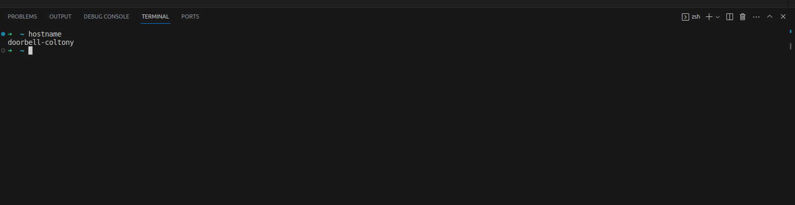

# Getting Started

Note: Make sure to fill out this file in VSCode, not in the browser.

## Experience Summary

### How many hours did it take to complete assignment?
An Hour and a half

### What did you enjoy about this lab?
The instructions were phenominal

### What were the major challenges you had with this lab? Try to be as detailed as possible.
Nothing major, except the Linux machine took awhile to recognize the doorbell. Other than that everything went extremely smooth

## Lab Specific Tasks
These tasks can be completed at the end of the setting up your Rasberry Pi Z2W.

<!-- The following tasks ask you to add screenshots to your downloaded folder. Look up how to take screenshots in Ubuntu. Then you can click and drag your saved PNG to the VS Code folder in the left pane. -->

1. If you haven't already, connect to your Pi Z2W with using the SSH extension on VSCode. Open a terminal in VSCode. Execute the `htop` command and take a screenshot. Save it to this folder as `htop.png`.

2. Execute the `hostname` command and take a screenshot. Save it to this folder as `hostname.png`. 

3. Take a screenshot like the last one in the lab writeup that shows the folder tree and terminal. Save it to this folder as `vscode.png`.

